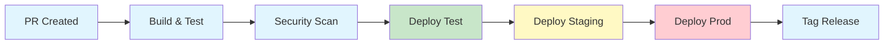
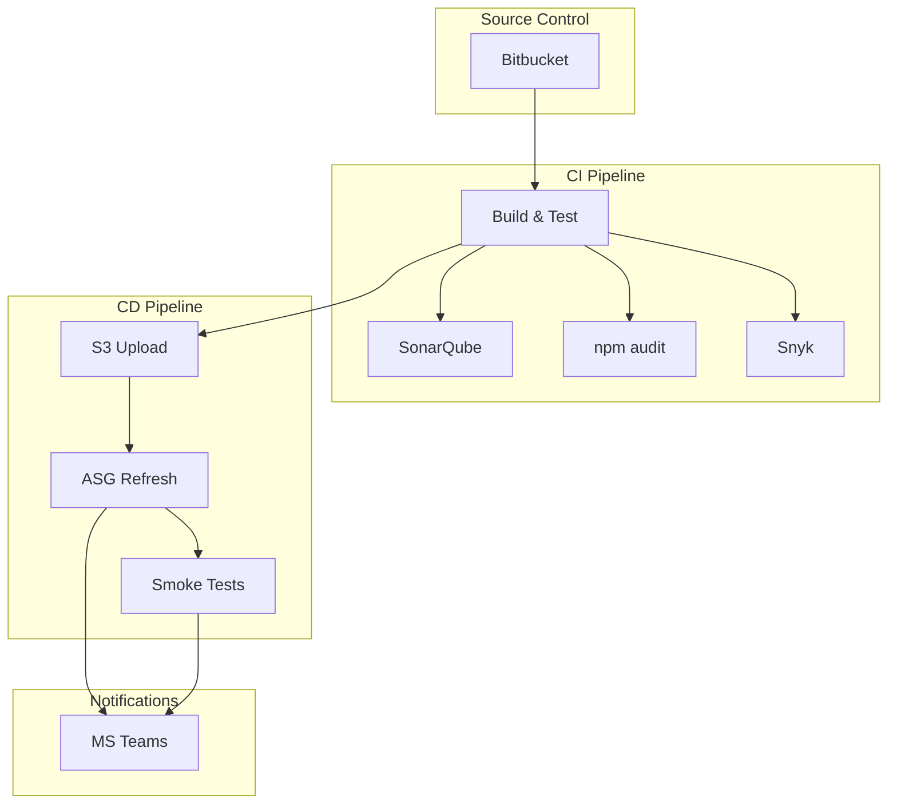
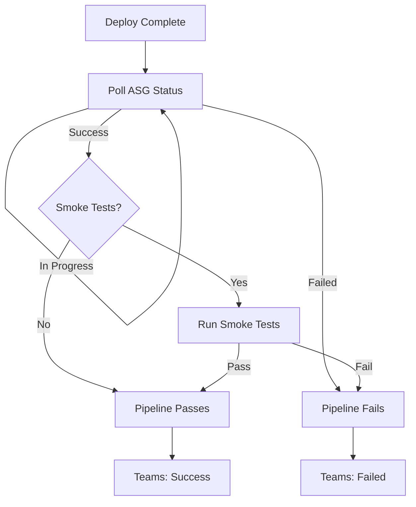

# CI/CD Pipeline Template - Release Notes

## Version 1.0.0 | January 2026

---

## What's New

Enterprise-grade Bitbucket Pipelines template for Node.js microservices deploying to AWS EC2 via Auto Scaling Groups.

---

## Highlights

| Feature | Description |
|---------|-------------|
| **Multi-Environment Deployments** | Dev, Test, Staging, Production with isolated configurations |
| **Security Scanning** | SonarQube, npm audit, and Snyk integration |
| **PR Security Reports** | Automated reports posted directly to pull requests |
| **Teams Notifications** | Real-time deployment status via Microsoft Teams |
| **Deployment Verification** | ASG health monitoring + optional smoke tests |
| **Database Migrations** | Prisma with Kerberos authentication support |
| **Kafka Provisioning** | Automated topic setup per environment |

---

## Pipeline Flow



---

## Branch Strategy

| Branch | Auto Deploy | Manual Deploy | Creates Tag |
|--------|-------------|---------------|-------------|
| `feature/*` | CI only | Dev | No |
| `release/*` | Test | Staging, Prod | On merge |
| `hotfix/*` | CI only | Prod | On merge |

---

## What's Included

### Pipeline Configuration
- `bitbucket-pipelines.yml` - Main pipeline definition with all stages

### Scripts

| Script | Purpose |
|--------|---------|
| `teams_notify.sh` | Microsoft Teams deployment notifications |
| `verify_deploy.sh` | ASG refresh monitoring + smoke tests |
| `release_report.sh` | Full security report for releases |
| `pr_report.sh` | Condensed PR security summary |
| `report_utils.sh` | Shared reporting utilities |
| `prisma_migration.sh` | Database migrations with Kerberos |
| `setup_kafka.sh` | Kafka topic provisioning |

### Documentation
- `DOCUMENTATION.md` - Full setup guide with diagrams
- `README.md` - Quick reference

---

## Integration Architecture



---

## Required Configuration

### Repository Variables

```
AWS_ACCESS_KEY_ID_{DEV|TEST|QA|PROD}
AWS_SECRET_ACCESS_KEY_{DEV|TEST|QA|PROD}
SONAR_TOKEN
SONAR_HOST_URL
TEAMS_WEBHOOK_URL (optional)
SNYK_TOKEN (optional)
BITBUCKET_EMAIL
BITBUCKET_API_TOKEN
```

### Environment Variables (per deployment)

```
ENV_SUFFIX: dev|test|qa|prod
AWS_SUFFIX: DEV|TEST|QA|PROD
S3_BUCKET: your-app-deploy-{env}
ASG_NAME: your-app-{env}-asg
SERVICE_NAME: your-service
INSTANCE_WARMUP: 300
```

---

## Getting Started

### 1. Copy to Your Service

```bash
cp bitbucket-pipelines.yml /your-service/
cp -r scripts/ /your-service/
```

### 2. Configure Bitbucket

- Add repository variables (AWS, SonarQube, etc.)
- Create deployment environments (Dev, Test, Staging, Prod)
- Set environment-specific variables

### 3. Create Release

```bash
git checkout -b release/1.0.0
git push origin release/1.0.0
# Open PR to main - pipeline runs automatically
```

---

## Teams Notification Setup

### Power Automate Workflow

1. Create workflow: "Post to a channel when a webhook request is received"
2. Select Adaptive Card
3. Paste template from `DOCUMENTATION.md`
4. Copy webhook URL to `TEAMS_WEBHOOK_URL`

### Card Preview

| Field | Example |
|-------|---------|
| Title | Deployment Succeeded |
| Service | my-service |
| Environment | PROD |
| Branch | release/1.0.0 |
| Commit | abc1234 |
| Status | Completed |

---

## Security Reports

### PR Report (All PRs)

Posted automatically showing issues introduced:

| Check | Status | Details |
|-------|--------|---------|
| SonarQube | Pass/Warn/Fail | Bugs, vulns, smells |
| npm audit | Pass/Warn/Fail | C:0 H:0 M:0 L:0 |
| Snyk | Pass/Warn/Fail | C:0 H:0 M:0 L:0 |

### Release Report (Release PRs)

Full project security snapshot with:
- Quality gate status
- All vulnerability counts
- Top issues list
- Git commits in release

---

## Deployment Verification



---

## Breaking Changes

None - this is the initial release.

---

## Migration Guide

For services currently using manual deployments:

1. **Copy template files** to your repository
2. **Add required variables** in Bitbucket settings
3. **Create deployment environments** with env-specific configs
4. **Test with feature branch** using `deploy-to-develop` pipeline
5. **Start release process** with `release/x.x.x` branch

---

## Support

- Full documentation: See `DOCUMENTATION.md`
- Questions: Contact DevOps team
- Issues: Open ticket in DevOps project

---

## Changelog

### v1.0.0 (January 2026)
- Initial release
- Multi-environment deployment support
- Security scanning (SonarQube, npm audit, Snyk)
- PR and release security reports
- Teams notifications
- Deployment verification with smoke tests
- Prisma migrations with Kerberos
- Kafka topic provisioning
- Docker build pipeline
