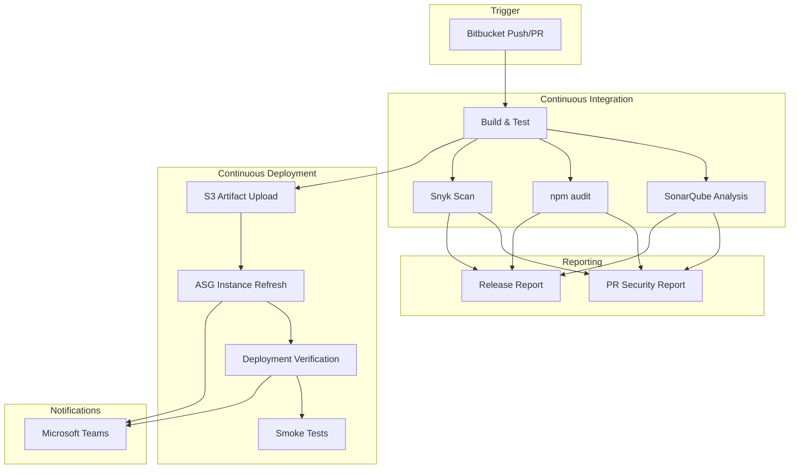
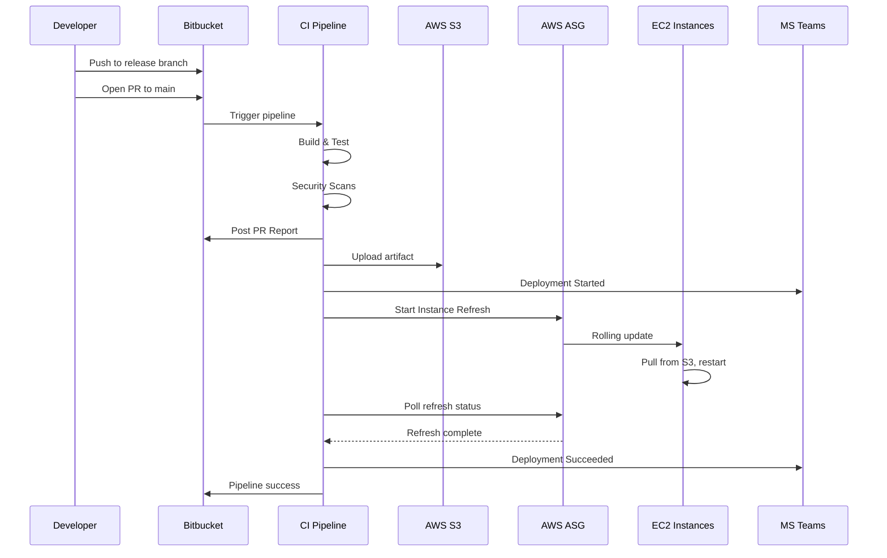
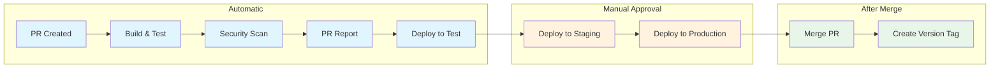
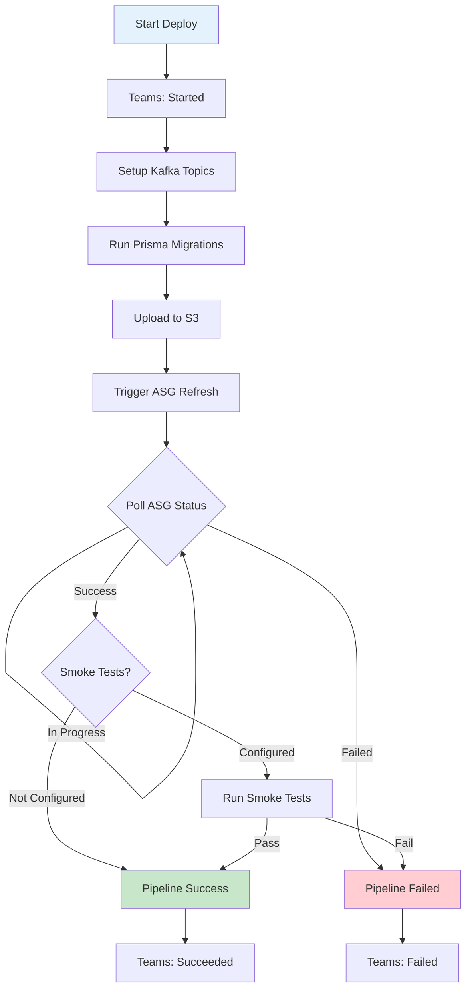
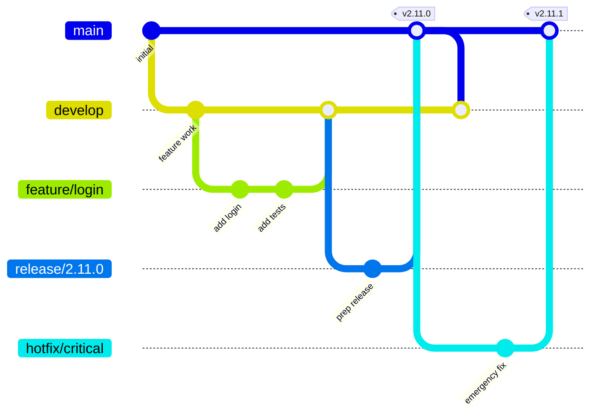
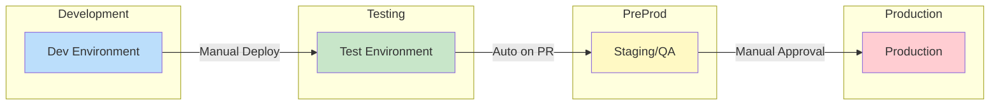
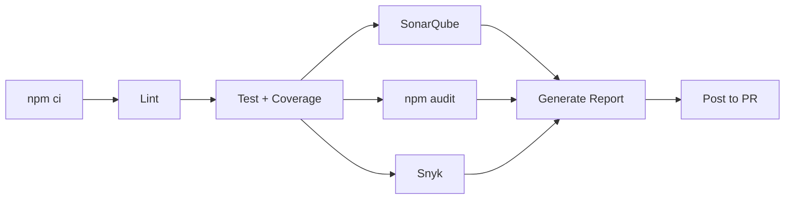

# EC2 Node Service CI/CD Documentation

Enterprise-grade Bitbucket Pipeline template for Node.js microservices deploying to AWS EC2 via Auto Scaling Groups.

## Table of Contents

- [Overview](#overview)
- [Features](#features)
- [Architecture](#architecture)
- [Pipeline Flow](#pipeline-flow)
- [Branch Strategy](#branch-strategy)
- [Quick Start](#quick-start)
- [Environment Configuration](#environment-configuration)
- [Script Reference](#script-reference)
- [Teams Notification Setup](#teams-notification-setup)
- [Security Scanning](#security-scanning)
- [Troubleshooting](#troubleshooting)

---

## Overview

This template provides a complete CI/CD solution for Node.js services with:

- Multi-environment deployments (dev, test, staging, production)
- Automated security scanning (SonarQube, npm audit, Snyk)
- PR-driven deployment workflow with approval gates
- Deployment verification with ASG monitoring and optional smoke tests
- Real-time notifications to Microsoft Teams

---

## Features

| Feature | Description |
|---------|-------------|
| **Multi-Environment** | Dev, Test, Staging, Production with isolated configs |
| **Security First** | SonarQube, npm audit, Snyk scanning on every build |
| **PR Reports** | Automated security reports posted to pull requests |
| **Deployment Verification** | ASG health checks + optional smoke tests |
| **Teams Notifications** | Real-time deployment status in Teams channels |
| **Database Migrations** | Prisma migrations with Kerberos auth support |
| **Kafka Provisioning** | Automated topic setup per environment |
| **Docker Support** | Optional Docker image builds to Docker Hub |

---

## Architecture

### Integration Ecosystem



### Deployment Flow



---

## Pipeline Flow

### Release Pipeline Stages



### Deployment Step Detail



---

## Branch Strategy

### Git Flow Visualization



### Branch Trigger Matrix

| Branch | Trigger | Pipeline | Environments |
|--------|---------|----------|--------------|
| `feature/*` | Push | CI Only | Dev (manual) |
| `release/*` | PR to main | Full Release | Test (auto) → Staging → Prod |
| `hotfix/*` | PR + Custom | Hotfix | Prod (manual) |
| `main` | Merge | Tag Only | - |

### Environment Progression



---

## Quick Start

### 1. Copy Template Files

```bash
# From this repo to your service repo
cp bitbucket-pipelines.yml /path/to/your-service/
cp -r scripts/ /path/to/your-service/
```

### 2. Create sonar-project.properties

```properties
sonar.projectKey=your-service-key
sonar.projectName=Your Service Name
sonar.sources=src
sonar.tests=src
sonar.test.inclusions=**/*.test.ts,**/*.spec.ts
sonar.typescript.lcov.reportPaths=coverage/lcov.info
```

### 3. Ensure Required npm Scripts

```json
{
  "scripts": {
    "lint": "eslint src/",
    "test": "jest --coverage",
    "build": "tsc",
    "kafka:setup": "ts-node scripts/kafka-setup.ts",
    "prisma:migration:deploy": "prisma migrate deploy",
    "prisma:generate": "prisma generate",
    "prisma:seed": "prisma db seed",
    "prepare:test": "ts-node scripts/prepare-test.ts"
  }
}
```

### 4. Configure Bitbucket Variables

See [Environment Configuration](#environment-configuration) below.

### 5. Create Your First Release

```bash
git checkout -b release/1.0.0
git push -u origin release/1.0.0
# Open PR from release/1.0.0 → main
# Pipeline automatically builds, tests, and deploys to Test
```

---

## Environment Configuration

### Repository Variables

Set in **Repository Settings → Repository variables**:

| Variable | Description | Example |
|----------|-------------|---------|
| `AWS_ACCESS_KEY_ID_DEV` | AWS key for dev | `AKIA...` |
| `AWS_SECRET_ACCESS_KEY_DEV` | AWS secret for dev | `wJal...` |
| `AWS_ACCESS_KEY_ID_TEST` | AWS key for test | `AKIA...` |
| `AWS_SECRET_ACCESS_KEY_TEST` | AWS secret for test | `wJal...` |
| `AWS_ACCESS_KEY_ID_QA` | AWS key for staging | `AKIA...` |
| `AWS_SECRET_ACCESS_KEY_QA` | AWS secret for staging | `wJal...` |
| `AWS_ACCESS_KEY_ID_PROD` | AWS key for prod | `AKIA...` |
| `AWS_SECRET_ACCESS_KEY_PROD` | AWS secret for prod | `wJal...` |
| `SONAR_TOKEN` | SonarQube auth token | `squ_...` |
| `SONAR_HOST_URL` | SonarQube server URL | `https://sonar.example.com` |
| `SNYK_TOKEN` | Snyk auth token (optional) | `abc123...` |
| `TEAMS_WEBHOOK_URL` | Teams webhook URL | `https://...webhook.office.com/...` |
| `BITBUCKET_EMAIL` | For PR commenting | `ci@example.com` |
| `BITBUCKET_API_TOKEN` | For PR commenting | `ATBB...` |

### Deployment Environment Variables

Set in **Repository Settings → Deployments → [Environment]**:

| Variable | Dev | Test | Staging | Prod |
|----------|-----|------|---------|------|
| `ENV_SUFFIX` | `dev` | `test` | `qa` | `prod` |
| `AWS_SUFFIX` | `DEV` | `TEST` | `QA` | `PROD` |
| `S3_BUCKET` | `app-deploy-dev` | `app-deploy-test` | `app-deploy-qa` | `app-deploy-prod` |
| `ASG_NAME` | `app-dev-asg` | `app-test-asg` | `app-qa-asg` | `app-prod-asg` |
| `SERVICE_NAME` | `my-service` | `my-service` | `my-service` | `my-service` |
| `INSTANCE_WARMUP` | `180` | `180` | `300` | `300` |

---

## Script Reference

| Script | Purpose | Usage |
|--------|---------|-------|
| `teams_notify.sh` | Send Teams notifications | `./scripts/teams_notify.sh [start\|success\|failure]` |
| `verify_deploy.sh` | Verify ASG refresh + smoke tests | `./scripts/verify_deploy.sh` |
| `release_report.sh` | Generate release security report | `./scripts/release_report.sh` |
| `pr_report.sh` | Generate PR security summary | `./scripts/pr_report.sh` |
| `report_utils.sh` | Shared reporting functions | Sourced by other scripts |
| `prisma_migration.sh` | Run database migrations | `./scripts/prisma_migration.sh <service> <env> [seed]` |
| `setup_kafka.sh` | Provision Kafka topics | `./scripts/setup_kafka.sh <env> [allow_recreate]` |

---

## Teams Notification Setup

### Power Automate Workflow Setup

1. **Create Workflow**
   - Go to Power Automate → Create → Instant cloud flow
   - Select "Post to a channel when a webhook request is received"
   - Choose your Team and Channel

2. **Configure Adaptive Card**

   Paste this template in the Adaptive Card field:

```json
{
  "type": "AdaptiveCard",
  "$schema": "http://adaptivecards.io/schemas/adaptive-card.json",
  "version": "1.4",
  "body": [
    {
      "type": "TextBlock",
      "size": "Large",
      "weight": "Bolder",
      "text": "@{triggerBody()?['title']}"
    },
    {
      "type": "ColumnSet",
      "columns": [
        {
          "type": "Column",
          "width": "auto",
          "items": [
            {
              "type": "TextBlock",
              "text": "@{triggerBody()?['serviceName']}",
              "weight": "Bolder",
              "size": "Medium"
            }
          ],
          "selectAction": {
            "type": "Action.OpenUrl",
            "url": "@{triggerBody()?['repoUrl']}"
          }
        },
        {
          "type": "Column",
          "width": "stretch",
          "items": [
            {
              "type": "TextBlock",
              "text": "@{triggerBody()?['buildNumber']}",
              "isSubtle": true,
              "horizontalAlignment": "Right"
            }
          ]
        }
      ]
    },
    {
      "type": "FactSet",
      "facts": [
        { "title": "Environment", "value": "@{triggerBody()?['environment']}" },
        { "title": "Branch", "value": "@{triggerBody()?['branch']}" },
        { "title": "Commit", "value": "@{triggerBody()?['commit']}" },
        { "title": "Status", "value": "@{triggerBody()?['status']}" },
        { "title": "Time", "value": "@{triggerBody()?['timestamp']}" }
      ]
    }
  ],
  "actions": [
    {
      "type": "Action.OpenUrl",
      "title": "View Pipeline",
      "url": "@{triggerBody()?['pipelineUrl']}"
    },
    {
      "type": "Action.OpenUrl",
      "title": "View Commit",
      "url": "@{triggerBody()?['commitUrl']}"
    },
    {
      "type": "Action.OpenUrl",
      "title": "View Branch",
      "url": "@{triggerBody()?['branchUrl']}"
    }
  ]
}
```

3. **Copy Webhook URL**
   - Save the workflow
   - Copy the HTTP POST URL
   - Add as `TEAMS_WEBHOOK_URL` in Bitbucket

### Notification Types

| Status | Title | When |
|--------|-------|------|
| `start` | Deployment Started | Before ASG refresh |
| `success` | Deployment Succeeded | After verification passes |
| `failure` | Deployment Failed | If verification fails |

---

## Security Scanning

### Scan Pipeline



### Report Status Logic

| Status | Condition |
|--------|-----------|
| FAILED | SonarQube quality gate ERROR or CRITICAL vulnerabilities |
| WARNINGS | HIGH severity issues or quality gate warnings |
| PASSED | All checks clear |

### PR Report Example

```
## Security Report

| Check | Status | Details |
|-------|--------|---------|
| SonarQube | Pass | 0 bugs, 0 vulns, 2 smells |
| npm audit | Warn | C:0 H:1 M:3 L:2 |
| Snyk | Pass | C:0 H:0 M:0 L:1 |
```

---

## Troubleshooting

### Common Issues

| Issue | Cause | Solution |
|-------|-------|----------|
| Teams notification not received | Webhook URL incorrect | Verify URL in Power Automate |
| ASG refresh timeout | Instances slow to start | Increase `ASG_REFRESH_TIMEOUT` |
| Prisma migration fails | Kerberos auth issue | Check `kinit` credentials |
| SonarQube fails | Token expired | Regenerate `SONAR_TOKEN` |
| PR report not posted | Missing API token | Set `BITBUCKET_API_TOKEN` |

### Debug Commands

```bash
# Test Teams notification locally
export TEAMS_WEBHOOK_URL="your-url"
export BITBUCKET_REPO_SLUG="test-service"
export ENV_SUFFIX="dev"
./scripts/teams_notify.sh start

# Check ASG status
aws autoscaling describe-instance-refreshes \
  --auto-scaling-group-name your-asg-name

# Verify SonarQube connectivity
curl -u $SONAR_TOKEN: "$SONAR_HOST_URL/api/system/health"
```

### Log Locations

- **Pipeline logs**: Bitbucket → Pipelines → Build number
- **ASG refresh logs**: AWS Console → EC2 → Auto Scaling → Activity

---

## Support

For issues or questions:
1. Check the [Troubleshooting](#troubleshooting) section
2. Review pipeline logs in Bitbucket
3. Contact the DevOps team

---

*Last updated: January 2026*
